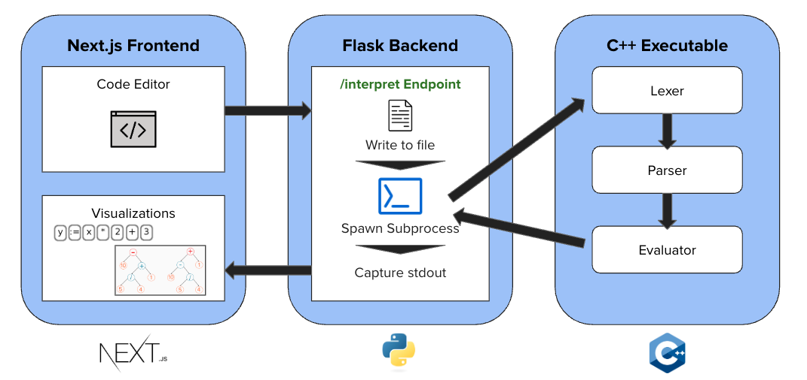

# RV Interpreter

A C++ interpreter for a custom Python-like language called **RV**. This project includes a **lexer**, **parser**, and **evaluator**—all written in C++. A **Flask backend** can be run as a server to handle interpretation requests, allowing a separate [frontend](https://github.com/rohanvan123/rv-interpreter-frontend) visualizer to interact with it.

## Live Deployment - [Try it Out!](https://rv-interpreter-frontend.vercel.app/)

This project is currently hosted live with the Next.js fronted hosted on **Vercel** and the Flask backend on **Render**. Initial requests may be very slow because it's based on the Render's free tier.

## 🧱 Architecture



## 🔧 Features

- 🧾 Custom language RV designed with Python-like syntax
- ⚙️ C++ implementation of lexer, parser, and evaluator
- 🌐 Flask-based backend to expose API endpoints for the interpreter
- 📊 Compatible with a React-based frontend visualizer

## 🚀 Getting Started

### 1. Clone the Repo

```bash
git clone https://github.com/your-username/rv-interpreter.git
cd rv-interpreter
```

### 2. Compile (Linux/macOS)

```bash
g++ -std=c++20 src/main.cpp -o bin/main
```

### 3. Run

```run
./bin/main <PATH_TO_FILE> [--output-lexer] [--output-parser]
```

- `<PATH_TO_FILE>` is a required argument that must be end in a .rv extension
- `[--output-lexer]` is an optional arg to print the lexer output
- `[--output-parser]` is an optional arg to print the parser output

---

## Running the Backend

### 1. Install all Dependencies

```bash
pip3 install -r requirements.txt
```

### 2. Run server

```bash
flask run
```
