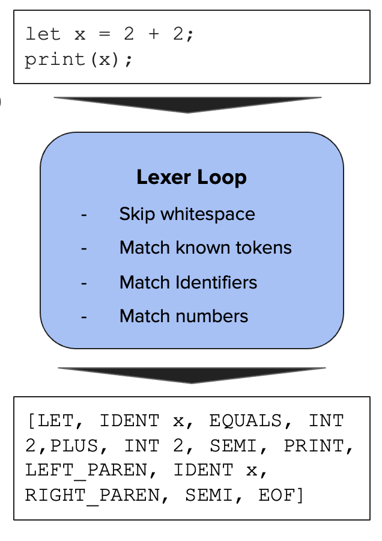

# Lexer Design

The Lexer converts raw source code (string) into a sequence of tokens (lexical units) based on my own custom set of keywords (let, print, if, …).

<p align="center">
    
</p>

The lexer follows a sliding window technique (with a bit nuance for special cases) for capturing the current string until a semicolon, new line character, or single character keyword. For special cases like integers and variables, I use regex matching.

## Pseudocode

```
while not end_of_source:
    skip_whitespace_and_newlines()

    if current_char is a single-char token:
        emit_token(single_char_map[current_char])
        advance()

    else:
        # Read until whitespace or special char
        lexeme = read_while(not whitespace or single_char)

        if lexeme in keywords:
            emit_token(keyword_map[lexeme])

        else if lexeme matches integer_pattern: # ([1-9][0-9]*)
            emit_token(INTEGER, lexeme)

        else if lexeme matches identifier_pattern: # ([a-z]+)
            emit_token(IDENTIFIER, lexeme)

emit_token(EOF)

```
