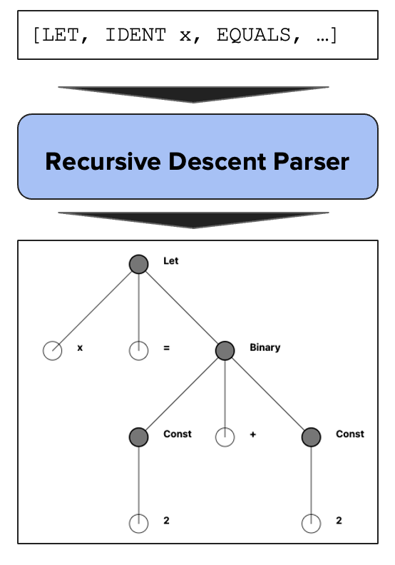
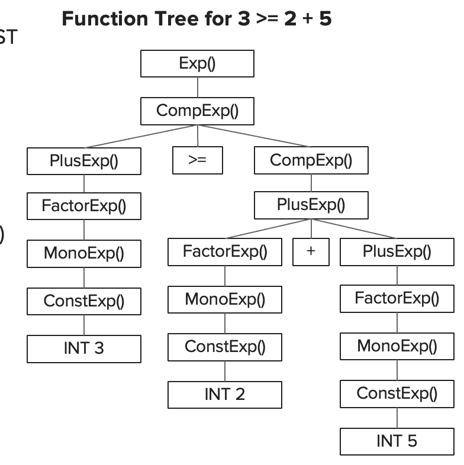

# Parser

The parser at a high level converts a list of tokens into an Abstract Syntax Tree for an interpreter to eventually evaluate. For this interpreter, I use two variants of a recursive descent parser.

<p align="center">
    
</p>

The high level Parser, implemented in the [`Parser.cpp`](../src/Parser.cpp), captures expressions like While loops, If/Else statements, Variable Declarations, List accesses, and more. The arithmetric parser, defined in [`ArithmeticParser.cpp`](../src/arithmetic_parser.cpp) is designed specifically for parsing arithmetic expressions like `3 * x + (4 % 5) + 77`.
The logic looks something like this

```
let x = exp1;
x = exp2;
while (exp3) {
    exp4;
    exp5;
    ...
}
```

exp1 - exp5 and so on will all be seperately parsed by the arithmetic parser, while the lets, whiles, and other expressions will be handled by the high level parser.

## Grammar & Parsing Technique

Acheiving operator precendance, handling parentheses, and other necessities or arithmetic expressions was a big challenge. I had to design an unambiguous [grammar](grammar.md) and use techniques like eliminating left recursion to achieve this.

<p align="center">
    
</p>
